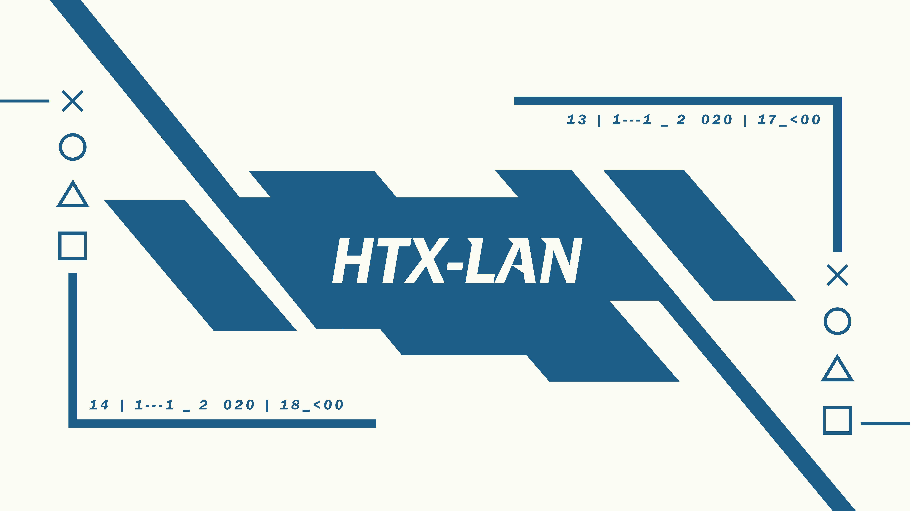

# Assets

Any assets or content present in this repository, located at [https://github.com/HTX-LAN/assets](https://github.com/HTX-LAN/assets) is the ownership of HTX LAN, and may not be used without the consent of HTX LAN.  
HTX LAN is represented by the "LAN udvalg" at HTX Nykøbing Falster, Denmark.

## Present assets

### Logo

  
Color: [#1d5e86](https://www.colorhexa.com/1d5e86)  
Text: [Asap](https://fonts.google.com/specimen/Asap)  
Present as [AI file](logo/HTX%20discord%20logo.ai) and as [64x64](logo/HTX%20discord%20logo%20(64x64).png)

### Banner

#### Primary

  
Color: [#1d5e86](https://www.colorhexa.com/1d5e86)  
Text: [Asap](https://fonts.google.com/specimen/Asap)  
Present as [AI file](banner/primary/banner.ai)

#### Social panels

| Name | Image | AI |
| ---- | --- | --- |
| Information |  | [AI file](banner/social%20panels/Informations%20panel.ai) |
| Rules |  | [AI file](banner/social%20panels/Regler%20Panel.ai) |
| Social media |  | [AI file](banner/social%20panels/Sociale%20medier%20panel.ai) |
| Turnament |  | [AI file](banner/social%20panels/Turnering%20Panel.ai) |

#### Social media banner

  
Present as [PS file](banner/facebook%20banner/facebook%20banner.psd)

### QR codes

| Name    | White                                                                                 | Black                                                                                 |
| ------- | ------------------------------------------------------------------------------------- | ------------------------------------------------------------------------------------- |
| Website |  |  |
| Discord |  |  |
| Twitch  |     |     |

### Poster

Several posters have been created for the HTX LAN, a number of them can be found in the folder [posters](posters)